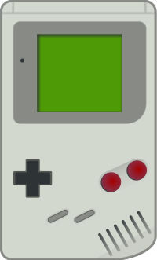
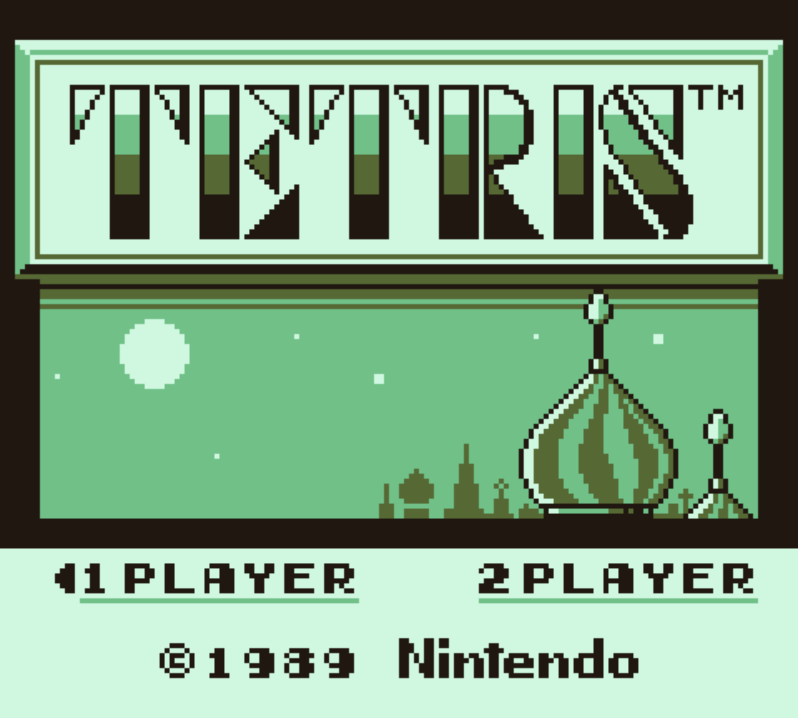

# gameperson

A Nintendo Gameboy emulator written in Rust.

## Usage

You'll need the [Gameboy boot rom](https://www.google.com/search?q=game+boy+boot+rom) and
a ROM file to run.

```shell
cargo run BOOT_ROM.bin ROM.gb
```

## Status

- [x] CPU opcodes
- [ ] Interrupts
  - [x] VBlank
  - [ ] LCD STAT
  - [ ] Timer
  - [ ] Serial
  - [x] Joypad
- [ ] Timers
- [ ] APU
- [ ] GPU
  - [x] BG map
  - [x] Sprites
  - [ ] Window

## Screenshots



## Contributing
Pull requests are welcome. For major changes, please open an issue first to discuss what you would like to change.

Please make sure to update tests as appropriate.

## License
[GPLv3](https://www.gnu.org/licenses/gpl-3.0.en.html)
